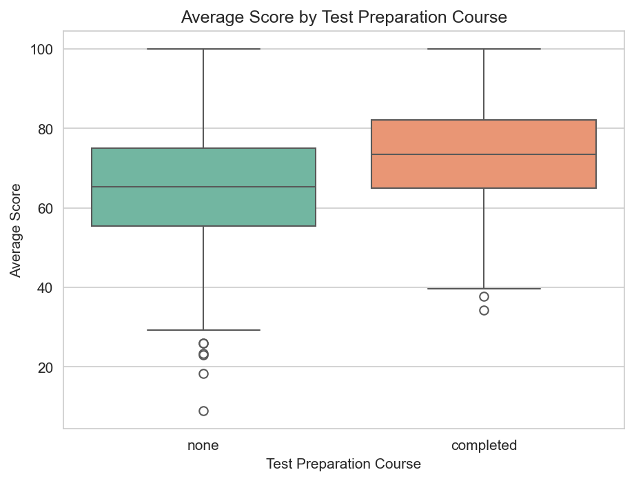
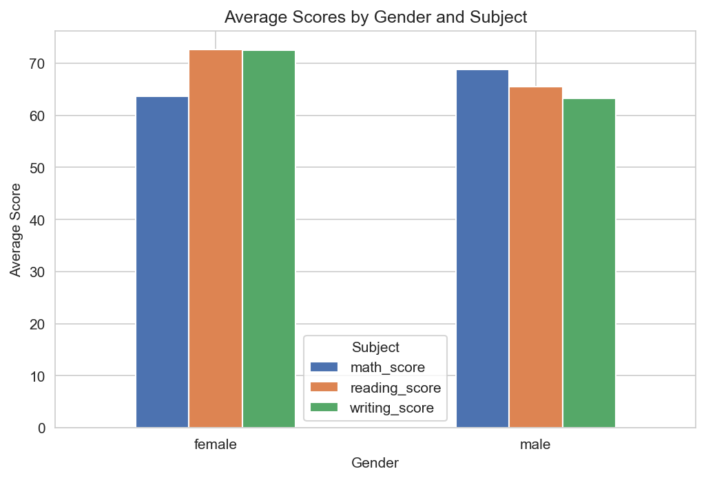

# Student Performance Analysis

## Overview
This project analyzes exam performance data for 1,000 students to explore how factors like test preparation, parental education, and gender relate to scores in math, reading, and writing.

## Dataset
[Students Performance in Exams](https://www.kaggle.com/datasets/spscientist/students-performance-in-exams) — Kaggle, by spscientist.
Contains gender, race/ethnicity, parental education level, lunch type, test preparation course status, and scores in math, reading, and writing for 1,000 students.

## Tools Used
Python, Pandas, NumPy, Matplotlib, Seaborn (Jupyter Notebook)

## Key Findings

1. **Test preparation improves scores.** Students who completed the test prep course scored noticeably higher on average than those who didn't.
2. **Parental education shows a steady positive trend.** Average scores rise fairly consistently as parental education level increases.
3. **Gender shows a subject-specific split**, not a uniform gap — males scored higher in math, while females scored higher in both reading and writing.
4. **Reading and writing scores are very strongly correlated (0.95)**, more than either is with math (0.80–0.82), suggesting they draw on more similar underlying skills.
5. **Overall scores are roughly normally distributed**, centered around 65-70.

## Charts

## Files
- `student_performance_analysis.ipynb` — full analysis notebook
- `StudentsPerformance.csv` — dataset
- `charts/` — saved chart images
